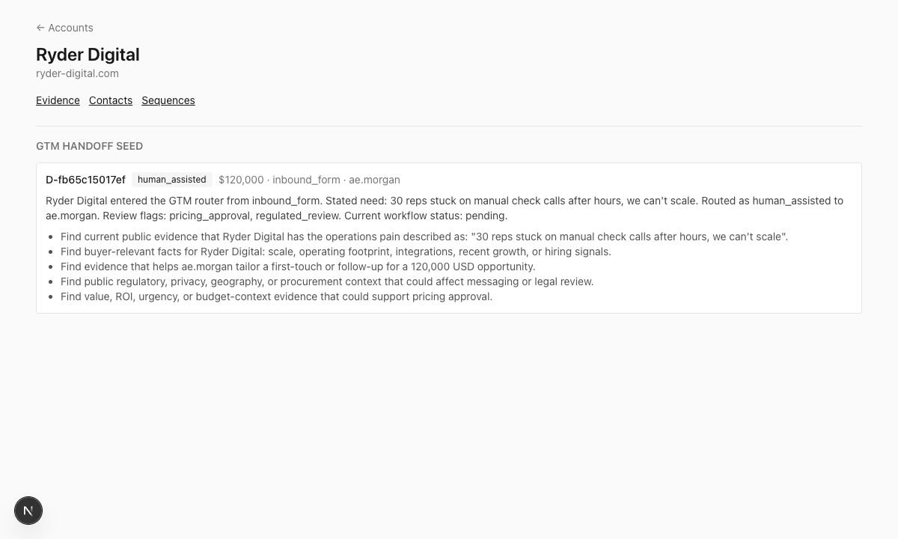
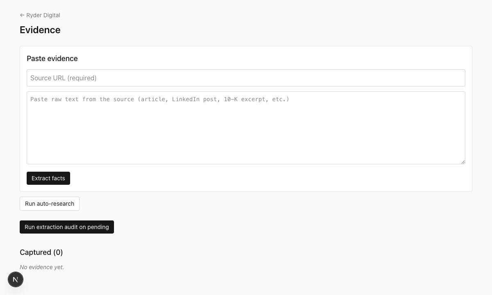

# Sales

Personal, local-first B2B sales research-and-outreach tool. Every factual claim in every draft traces to a verified evidence row. Drafts are critiqued against a user-owned principles file. Every revision is preserved.

## Companion GTM control plane

This repo owns evidence-grounded research and outreach. The companion
[`gtm-ops-router`](https://github.com/gorajing/gtm-ops-router) repo owns the
upstream operating ledger: inbound deal intake, enrichment, route decisions,
finance/legal flags, role queues, deployment readiness, audit events, and
operator-visible workflow state.

```text
        gtm-ops-router                         Sales
inbound deal -> route/work item -> sales handoff JSON -> evidence research -> drafted outreach -> critic review
```

`gtm-ops-router` emits a `gtm-ops-router.sales-handoff.v1` JSON payload as a
research seed. Sales treats that payload as context, not verified evidence:
public facts still need to become evidence rows and pass the verification and
critic workflow before they appear in outreach.

Import a router export into Sales:

```bash
pnpm import:gtm-handoff ../gtm-ops-router/data/sales-handoff.json
```

The importer creates or reuses accounts and contacts, stores the router handoff
as a `gtm_handoff_imports` record, and leaves the Evidence table untouched until
you capture and audit public sources.

## Demo



The router seed is context only — the Evidence tab stays empty until you capture
and audit public sources:



Full cross-repo walkthrough: see [the demo script](https://github.com/gorajing/gtm-ops-router/blob/main/docs/DEMO_SCRIPT.md). To try
just the Sales side:

```bash
pnpm import:gtm-handoff ../gtm-ops-router/data/sales-handoff.sample.json
pnpm dev   # http://localhost:3000
```

The account shows the router seed; the Evidence table stays empty until you
capture and audit public sources.

## Requirements
- macOS with the `claude` CLI installed and logged into a Claude Max 20 account
- Node.js 20.9+, pnpm

## Setup

```bash
pnpm install
pnpm db:generate   # idempotent after first run
pnpm db:migrate
pnpm dev
```

Open http://localhost:3000.

## Workflow

1. **Create an account.** Add the target company.
2. **Gather evidence.**
   - Paste URLs + raw text into the Evidence tab, OR
   - Click "Run auto-research" to have the Claude CLI research the account via WebFetch + WebSearch.
3. **Audit evidence.** Click "Run extraction audit on pending" — each fact is checked against its snippet. Disputed rows show a reason and a suggested correction.
4. **Add a contact** (optional; sets the buyer archetype for the drafter).
5. **Create a sequence.** Pick channels per touch (email / LinkedIn).
6. **Draft each touch.** The drafter uses only verified evidence. The validator ensures every cited claim is a verbatim substring of its evidence snippet. If the draft fails validation, it retries once with a correction message.
7. **Run critics.** Three critics score each draft:
   - **Skeptical Buyer** (Sonnet) — "Would I delete this in 2 seconds?"
   - **Sales Coach** (Sonnet) — scores against every principle in `data/principles.md`.
   - **Writing Editor** (Haiku) — concision, AI-tell phrases, active voice.
8. **Accept rewrites.** Each accepted rewrite creates a new immutable revision; prior revisions and their critiques are preserved.
9. **Export.** Download `.eml` files for email touches and `.txt` for LinkedIn. Touch 1 is copied to clipboard.

## Key files
- `data/principles.md` — the Sales Coach critic rubric. Edit as your tactical bar evolves.
- `data/icp.md` — ICP brief. Read by the drafter on every touch. Fill in before your first draft.
- `skills/` — Claude Code-compatible skill files used by the CLI subprocess.
- `docs/superpowers/specs/` — full design spec (v2).
- `docs/superpowers/plans/` — implementation plan.

## Architecture

Next.js 16 App Router + SQLite (Drizzle ORM) + `claude` CLI subprocess for every LLM call. No Anthropic API key is used — the CLI authenticates via the owner's existing Max 20 OAuth session.

Three layers with strict contracts:
1. **Evidence (spine):** typed, append-only store. Every fact has a `source_url`, `snippet` (≤1500 char verbatim excerpt), and `extractionStatus` (`pending_audit` | `verified` | `disputed`). Only `verified` rows can be cited in a draft.
2. **Drafting:** pulls verified evidence, calls Claude, emits `cited_evidence_ids` + `supporting_spans` (verbatim substrings of snippets). Validator rejects any span that isn't a substring; one-retry loop on failure.
3. **Critique:** 3 parallel critics produce structured findings. Accept/reject per suggestion. Accepting a rewrite creates a new immutable `touch_revisions` row; prior revisions remain intact.

## Scope

v1 MVP. Out of scope:
- SMTP/Gmail sending (copy-paste the `.eml` into Gmail).
- CRM sync.
- Multi-user / SaaS.
- Deep Research paste parser, Perplexity MCP, GPT-5 critic — deferred to v1.1+.

See `docs/superpowers/specs/2026-04-17-sales-tool-design.md` §10, §11.

## Tests

```bash
pnpm test
pnpm typecheck
pnpm build
```
